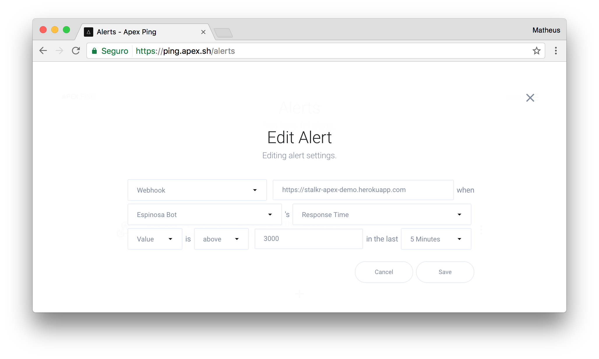

<h1 align="center">
	
	<br>
	<br>
</h1>

<br>
<br>

<p align="center">
	<a href="https://getstal.kr">stalkr</a> micro service which feeds our clients with Apex Ping response time alerts.
</p>

<br>

---

## Table of Contents

<!-- DO NOT EDIT THE COMMENTS BELOW -->

<!-- toc -->

- [Usage](#usage)
  * [A Few Technical Notes](#a-few-technical-notes)
    + [WebHooks](#webhooks)
    + [Pusher](#pusher)
  * [Getting Started](#getting-started)
    + [Locally](#locally)
    + [Deploying](#deploying)
    + [On Apex Ping](#on-apex-ping)
    + [On The TV](#on-the-tv)

<!-- tocstop -->

## Usage

### A Few Technical Notes

#### WebHooks

Webhooks are *user-defined HTTP callbacks* which are usually triggered by some event, such as pushing code to a repository–**which is what happens here**–or a comment being posted to a blog. When that event occurs, the source platform makes an HTTP request to the URI which as been previously set for the webhook.

Users can set them to cause events on one site to invoke behaviour on another. The action taken may be anything. Common uses are to trigger builds with continuous integration systems or to notify bug tracking systems–**and that's how stalkr works**. Since they use HTTP, they can be integrated into web services without adding new infrastructure.

#### [Pusher](pusher.com)

We intend to work over a bunch of different realtime frameworks–e.g. [Socket.IO](https://socket.io/), [Primus](https://github.com/primus/primus) and [ws](https://github.com/websockets/ws)–and services–e.g. [Ably](https://www.ably.io/), [PubNub](https://www.pubnub.com/) and [Pusher](pusher.com) itself–based on a commom protocol for transporters.

But now Pusher has shown to achieve good documentation/examples, a solid API, and great backend/debug tools, which led us to deal, in our *Minimum Viable Product*, only with Pusher.

Then you need to [create an account](https://dashboard.pusher.com/accounts/sign_up), and make a note of your `app_id`, `app_key` and `app_secret` for each project you'd like to integrate with *stalkr*.

### Getting Started

#### Locally

1. Make sure you define the `ENV` variables below:

    ```sh
    # Pusher credentials
    export PUSHER_ID='123456'
    export PUSHER_KEY='4JEUi0C2UT49m872Euc5'
    export PUSHER_SECRET='Bzx2MlrMbNtBpZv391J1'

    # Basic stalkr cell metadata
    export STALKR_TEAM='myTeam'
    export STALKR_PROJECT='myProject'
    ```

1. Clone this repository:

    ```sh
    git clone https://github.com/getstalkr/apex_ping-alerts
    ```

1. Install all dependencies:

    ```sh
    # via npm
    npm install
    # or using yarn
    yarn
    ```

1. Launch it:

    ```sh
    # via npm
    npm start
    # or using yarn
    yarn start
    ```

If everything goes okay, it should now be running at [`localhost:3000`](http://localhost:3000).

#### Deploying

Just follow the very same logical steps and deploy in the *PaaS*–or any similar service–of your choice.

#### On Apex Ping

Follow both [Checks](https://apex.sh/docs/ping/checks/) and [Alerts](https://apex.sh/docs/ping/alerts/) creation instructions and then paste the URL where you've deployed your *stalkr* webhook in the `URL` form field.

Your configuration should look similar to this:

<p align="center">
	
</p>

#### On The TV

<p align="center">
	
</p>

1. Install the Stalkr on your  TV

1. Go to `New Dashboard` tab.

    > We recommend the use of one iPhone or remote keyboard to set the config in inputs.

1. You don't need to fill all the steps, but only the section `Dashboard` and, in the next sections, you'll need to fill only if you want this cell in your dashboard.

1. In order to know how to set a "Pusher Key" parameter, see the [Pusher](#Pusher) section.

---

**Maintainer**:

> [ythecombinator.me](https://ythecombinator.me) &nbsp;&middot;&nbsp;
> GitHub [@ythecombinator](https://github.com/ythecombinator) &nbsp;&middot;&nbsp;
> Twitter [@ythecombinator](https://twitter.com/ythecombinator)
